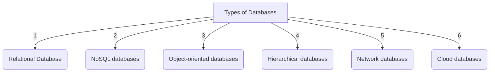

# Types of Database

| Type                | Description                                                                                                                                                                         |
| ------------------- | ----------------------------------------------------------------------------------------------------------------------------------------------------------------------------------- |
| **Relational**      | Stores data in **tables** with `rows` and `columns`. Uses SQL for **access** and **manipulation**. Good for organized data like customer information.                               |
| **NoSQL**           | Stores **unstructured** or **semi-structured** data like social media posts or sensor data. Faster and more scalable than relational databases, but can be more difficult to query. |
| **Object-oriented** | Stores data in objects that encapsulate data and operations. Good for **_complex data with relationships_**, like product or engineering data.                                      |
| **Hierarchical**    | Organizes data in a tree-like structure with parent and child nodes. Good for data with natural hierarchy, like parts catalogs or organizational charts.                            |
| **Network**         | Organizes data in a network structure with records having multiple parents and children. Good for data with complex relationships.                                                  |
| **Cloud**           | Databases hosted in the `cloud`, `managed` by **cloud providers**. **Good for quick and easy scaling**.                                                                             |

**The best type of database for a particular application will depend on the specific needs of that application.**

**Some factors to consider when choosing a type of database include:**

1. **`The type of data that will be stored`**
2. **`The size of the data set`**
3. **`The performance requirements of the application`**
4. **`The need for scalability`**
5. **`The cost`**
