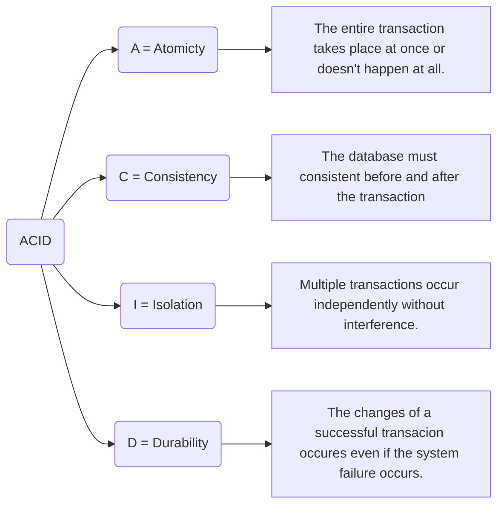

# ACID

**The ACID properties is a set of principles designed to ensure the reliability of database transactions.**

## Atomicity

Atomicity guarantees that **_all operations within a transaction are completed successfully or none at all_**, which means **_either the entire transaction succeeds or it fails, and the database is left unchanged_**.

## Consistency

It ensures that every transaction brings the database from one valid state to another, maintaining all predefined rules.

## Isolation

It ensures that the concurrent execution of transactions results in a system state that would be obtained if transactions were executed serially.

## Durability

It guarantees that once a transaction has been committed, it will remain so, even in the event of a system crash​​​​.

# Trade-offs

1. **Performance and Scalability**: Ensuring ACID properties can lead to performance bottlenecks, particularly in distributed systems where the **_overhead of maintaining consistency_** and **_isolation can be high_**.

2. **Complexity**: Implementing and maintaining ACID properties can add complexity to database management, requiring more resources to ensure data integrity and reliability​​.
